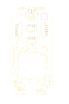

# stm-mini-breakout
Breakout board for STM32H723ZGT6 MCU. Powered and programmed via USB C (FS). WIP.

Demonstration board for high-powered STM32s. 

## Schematics

# MCU

# Communication and Debug

# Power, Clock, and IO

## PCB Layout

